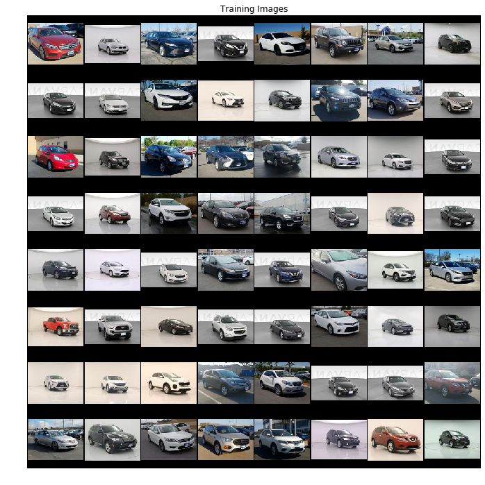
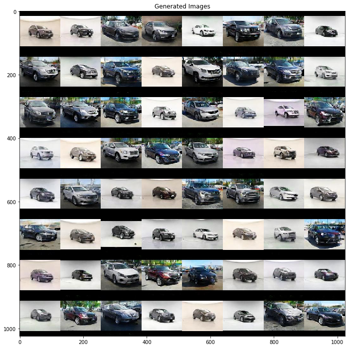

# Car Design Generation with DCGANs

In this project, we generated images of new car models through Deep Convolutional Generative Adversarial Networks (DCGANs). We wanted to explore the possibilities of generative networks by trying to create new marketable products, and we decided on cars as we found good amounts of scrapable data online. After gathering our data, we trained and tested different models, learning how to avoid many different GAN issues that lead to unusable results. Then, we explored different standard GAN problems like inpainting and image restoration. Finally, we suggest where changes and improvements could be made to our project if someone were to further explore the field.

Below shows the evolution of the images generated by our DCGAN from 70 epochs

Below are the training images used for our DCGAN. The images used are 128x128, and includes vehicles all facing the same angle. The images were obtained from Carvana and Carmax.

Below are the final results after training our DCGAN for 170 epochs. Training beyond this can potentially yield even better images with greater detail.

